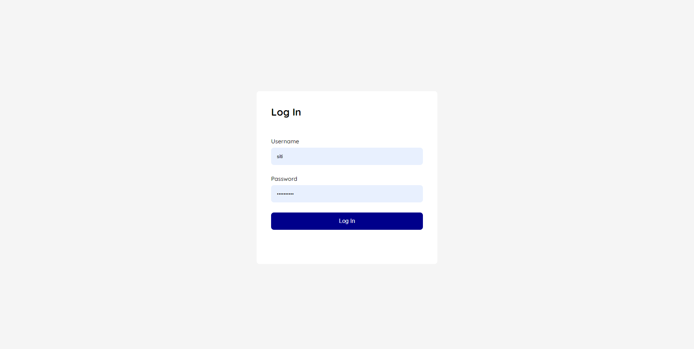

# Kiddocare Assignment

## Table of contents

- [Overview](#overview)
  - [The challenge](#the-challenge)
  - [Screenshots](#screenshot)
- [My process](#my-process)
  - [Built with](#built-with)

## Overview

### How to login
- Use any pair of username and password from users.txt

### The assignments

#### Assignment 1
Users should be able to:
- Login, access a secure page, and logout.
- Without a valid login, a user should not be able to access the secure page, and will be redirected to login.php.

#### Assignment 2
Users should be able to:
- View a dashboard with 6 widgets: Total Sales, Total Orders, Daily Sales, Percentage of sales by product categories, Sales numbers by customers, Sales numbers by employees

### Screenshots

## My process

### Built with

- PHP
- HTML
- Vanilla CSS
